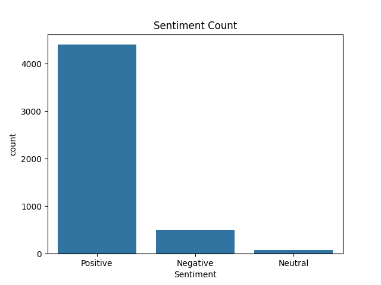
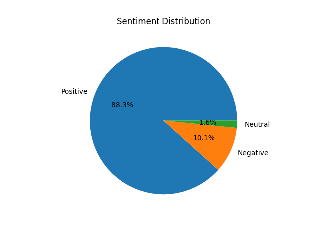
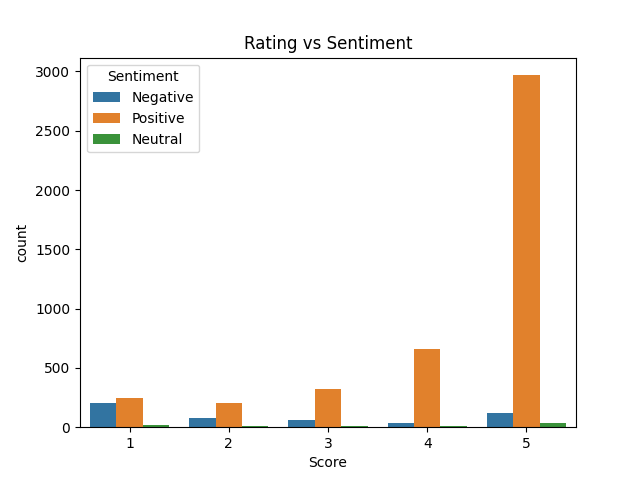

# Sentiment Analysis on Product Reviews

## 📌 Project Overview
This project performs Sentiment Analysis on Amazon Fine Food product reviews using Python and Natural Language Processing (NLP).

The main objective of the project is to automatically classify customer reviews into:
- Positive
- Negative
- Neutral

The project uses the TextBlob library for sentiment polarity analysis and generates meaningful insights using visualizations.

---

## 🎯 Problem Statement
E-commerce platforms receive thousands of customer reviews every day. Manually analyzing each review is time-consuming and inefficient.

This project helps automate the process of understanding customer satisfaction through sentiment analysis.

---

## 📂 Dataset
Dataset used:
Amazon Fine Food Reviews Dataset

Source:
https://www.kaggle.com/datasets/snap/amazon-fine-food-reviews

- First 5000 rows were used for analysis.
- Dataset file: `Reviews.csv`

---

## 🛠️ Technologies & Libraries Used

- Python
- Jupyter Notebook
- Pandas
- NumPy
- TextBlob
- Matplotlib
- Seaborn

---

## ✅ Tasks Performed

### 1. Data Loading & Exploration
- Loaded dataset using Pandas
- Displayed first 10 rows
- Checked dataset shape
- Identified review text column

### 2. Data Cleaning
- Removed null values
- Removed duplicate reviews
- Selected important columns:
  - Text
  - Score

### 3. Sentiment Analysis
Used TextBlob to calculate sentiment polarity.

Sentiment labeling:
- Positive → polarity > 0
- Negative → polarity < 0
- Neutral → polarity = 0

### 4. Data Visualization
Created multiple charts for better understanding:
- Bar chart of sentiment counts
- Pie chart of sentiment distribution
- Rating vs Sentiment comparison chart

### 5. Insights Generation
Generated insights based on customer reviews and sentiment distribution.

---

## 📊 Project Results

- Positive Reviews: **88.3%**
- Negative Reviews: **10.1%**
- Neutral Reviews: **1.6%**

The analysis showed that most customers were satisfied with Amazon food products.

---

## 📈 Visualizations

### Sentiment Count Bar Chart


### Sentiment Distribution Pie Chart


### Rating vs Sentiment Comparison


---

## 🔍 Key Insights

- Most reviews were positive, indicating high customer satisfaction.
- Negative reviews mainly complained about:
  - product quality,
  - packaging issues,
  - taste expectations.
- Very few reviews were neutral.
- Some low-rated reviews were still classified as positive because the text contained positive words.

---

## 💡 Business Recommendation

The business should focus on improving packaging quality and maintaining product consistency to reduce negative reviews and improve customer experience.

---

## 📁 Project Structure

```bash
sentiment-analysis/
│
├── analysis.ipynb
├── Reviews.csv
├── requirements.txt
├── README.md
├── Summary.pdf
│
└── charts/
    ├── bar_chart.png
    ├── pie_chart.png
    └── rating_vs_sentiment.png
```

---

## ▶️ How to Run the Project

1. Clone the repository

```bash
git clone https://github.com/mahakkanwar0-spec/sentiment-analysis.git
```

2. Install required libraries

```bash
pip install -r requirements.txt
```

3. Open Jupyter Notebook

```bash
jupyter notebook
```

4. Run `analysis.ipynb`

---

## 👩‍💻 Author

Mahak Kanwar
